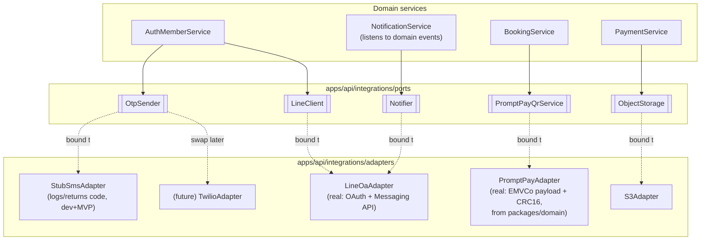
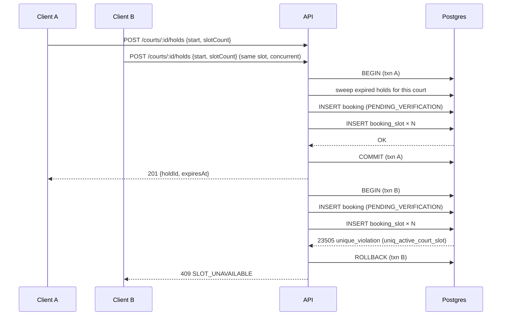
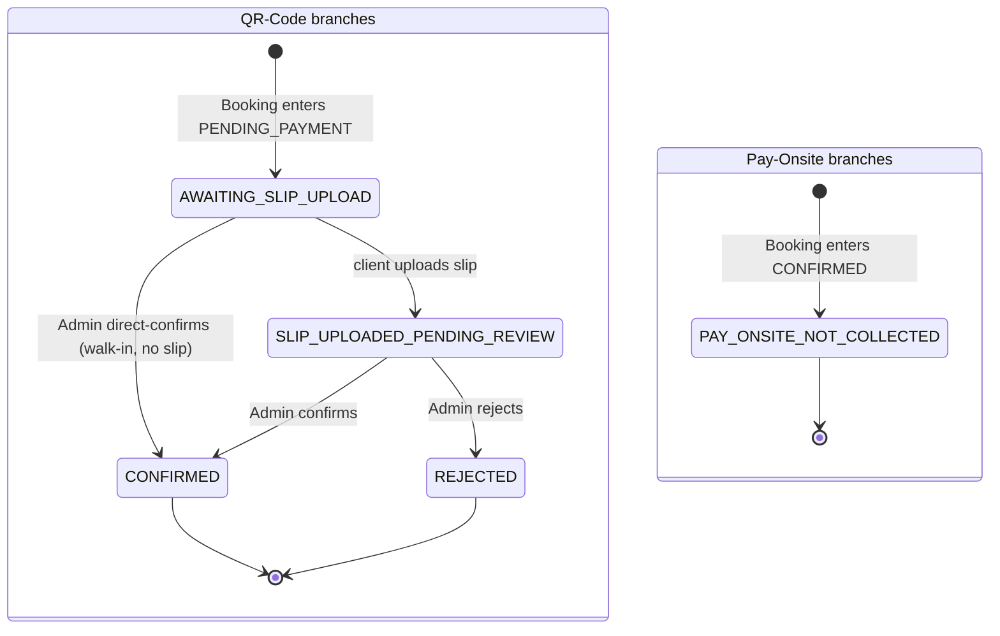

# court2go — System Architecture

**Author:** Solution Architect
**Date:** 2026-07-25
**Status:** Final for MVP build. Inputs: `docs/PRD.md` (rev 6), `docs/DESIGN.md`, `docs/HANDOFF.md`.
**Feeds:** `api-designer` (OpenAPI + `packages/types`), `prisma-data` (schema/migrations/ERD), `lead` (milestone plan), all build agents.

This document is implementation-ready. Section 9 lists everything that blocks the next two agents and how it's resolved or flagged.

---

## 0. Summary of the hard calls made here

| # | Decision | Answer | Detail |
|---|---|---|---|
| 1 | Monorepo | Turborepo + pnpm workspaces, `apps/web` + `apps/api` + `packages/types` + `packages/domain` + `packages/config` | §1 |
| 2 | Multi-tenancy | Shared DB, shared schema, `tenantId` on every tenant-owned row, **Postgres Row-Level Security as the hard guarantee**, Prisma Client Extension for ergonomics/defense-in-depth | §2 |
| 3 | Auth | Dual actor types (Member, AdminUser), both DB-backed sessions (not stateless JWT) for instant revocation | §3 |
| 4 | Integrations | Ports-and-adapters: `OtpSender` (stub SMS), `LineClient` (real OAuth + Messaging API), `PromptPayQrService` (real, deterministic, no gateway) | §4 |
| 5 | **Hold/concurrency** | **Postgres partial unique index** on a `booking_slot` table: `UNIQUE (court_id, slot_start) WHERE released_at IS NULL` | §5 |
| 6 | Status machines | PRD's Booking/Payment status sets confirmed **with one gap fixed** (Pay-Onsite Hold-expiry path, previously implied QR-only) | §6 |

---

## 1. Monorepo layout

```
court2go/
├── apps/
│   ├── web/                 # Next.js 15 (App Router), single app, two route trees
│   │   ├── app/
│   │   │   ├── (public)/[tenantSlug]/          # client mobile-first: news feed, booking, login, profile
│   │   │   └── (admin)/[tenantSlug]/admin/     # admin console: calendar, queues, config
│   │   ├── lib/api-client.ts                   # typed fetch wrapper bound to packages/types
│   │   ├── lib/query/                          # TanStack Query hooks, one file per resource
│   │   └── middleware.ts                       # tenant-slug resolution, session cookie read
│   │
│   ├── api/                 # NestJS
│   │   ├── src/
│   │   │   ├── modules/
│   │   │   │   ├── tenants/ branches/ sports/ courts/
│   │   │   │   ├── availability/                # grid computation, read-only
│   │   │   │   ├── bookings/                    # hold lifecycle, status machine
│   │   │   │   ├── payments/                    # slip upload, confirm/reject, PromptPay QR
│   │   │   │   ├── members/ auth-member/        # phone+OTP, LINE login, profile
│   │   │   │   ├── admin-users/ auth-admin/      # admin login, RBAC
│   │   │   │   ├── promotions/ news/ config/ branding/
│   │   │   │   └── notifications/                # LINE OA dispatch, event listeners
│   │   │   ├── integrations/
│   │   │   │   ├── ports/        # OtpSender, LineClient, Notifier, ObjectStorage interfaces
│   │   │   │   └── adapters/     # StubSmsAdapter, LineOaAdapter, S3Adapter, PromptPayAdapter
│   │   │   ├── common/            # guards, interceptors, tenant-context (ALS), exception filter
│   │   │   ├── jobs/              # hold-expiry sweeper (cron + advisory lock)
│   │   │   └── prisma/            # PrismaService, RLS session-var wiring, client extension
│   │   └── prisma/                # schema.prisma, migrations/ (owned by prisma-data)
│   │
├── packages/
│   ├── types/                # THE CONTRACT: zod schemas + inferred TS types (DTOs, enums)
│   ├── domain/                # pure functions both apps may import: pricing calculator,
│   │                          #   grid/slot-count validators, EMVCo PromptPay payload builder
│   └── config/                # eslint-config, tsconfig base, tailwind preset, prettier
│
├── turbo.json
├── pnpm-workspace.yaml
└── docs/
```

**Why a single `apps/web`, not separate client/admin apps:** both surfaces share the tenant-branding pipeline, the same TanStack Query/API-client plumbing, and the same design tokens (`docs/DESIGN.md`); splitting into two Next apps would double the build/deploy surface for no isolation benefit (the admin console isn't public-anonymous — it's behind its own auth guard regardless of which app serves it). Route groups `(public)` and `(admin)` give clean layout separation (mobile-first shell vs. desktop admin chrome) without a second deployable.

**Why `packages/domain` is separate from `packages/types`:** `types` is the wire contract (zod schemas, no logic). `domain` holds pure, side-effect-free business rules — the peak/base pricing calculator (PRD A5.1 AC10, summed per grid unit), per-court grid-interval alignment, slot-count (1..`maxSlots`) validation, and the PromptPay EMVCo payload/CRC16 builder. Both apps import `domain` so there is exactly one implementation of "how is price computed" — `apps/web` uses it only for optimistic price preview before submit; `apps/api` uses it as the **authoritative** calculation at hold-creation and payment time. The client-computed value is never trusted server-side.

**Turborepo pipeline** (`turbo.json`): `build` (web, api, domain, types — types/domain build first as deps), `dev` (parallel, persistent), `lint`, `typecheck`, `test` (unit: domain + api services; component: web), each cached/scoped by package. Package manager: pnpm workspaces (fast, disk-efficient, matches Turborepo's reference setup).

**Tooling:** TypeScript strict mode everywhere; ESLint + Prettier via `packages/config`; Tailwind + shadcn/ui in `apps/web` only (admin chrome stays neutral per DESIGN.md — implemented as a separate Tailwind theme class on the `(admin)` layout root, not a separate package); Vitest for unit tests, Playwright for e2e (booking flow, admin queues).

---

## 2. Multi-tenant strategy

**Resolved (HANDOFF #2): tenant-scoped from day 1, shared database/shared schema.** Rejected schema-per-tenant and database-per-tenant as premature for MVP scale (internal-ops-provisioned tenants, no self-serve signup, no near-term need for per-tenant physical isolation) — see ADR-0002.

### 2.1 Two enforcement layers (belt and suspenders)

Given PRD NFR4 explicitly says cross-tenant leakage is a **critical-severity defect**, a single layer (app-code discipline alone) is not enough — a missed `where: { tenantId }` in one query is a data breach. Two independent layers:

1. **Postgres Row-Level Security (the hard guarantee).** Every tenant-owned table gets `ENABLE ROW LEVEL SECURITY` and a policy `USING (tenant_id = current_setting('app.tenant_id')::uuid)`. Each request's Prisma transaction opens with `SET LOCAL app.tenant_id = '<uuid>'` before any other statement. Even a raw SQL query, a forgotten `where`, or a future engineer bypassing the ORM cannot return another tenant's rows — the database itself refuses. The Postgres app role used by Prisma is **not** a superuser/table-owner (RLS is bypassed by table owners/superusers by default), which is enforced by using a dedicated least-privilege `app_user` DB role.
2. **Prisma Client Extension (ergonomics + fail-fast defense in depth).** A request-scoped tenant context (Node `AsyncLocalStorage`) is populated by NestJS middleware from the resolved tenant (see 2.2). A Prisma Client Extension wraps every query on tenant-owned models: it throws immediately if no tenant is present in the ALS context (rather than silently running unscoped), and auto-injects `tenantId` into `where`/`create` payloads so individual service code never has to remember to do it. This is what makes RLS *practically* reachable — RLS depends on `SET LOCAL app.tenant_id` being set every transaction, and the extension is also where that `SET LOCAL` is issued (inside the same Prisma `$transaction` as the query, so it can never run stale).

If either layer alone had a bug, the other still holds the invariant. This directly satisfies PRD NFR4 ("must hold even on shared infrastructure").

### 2.2 Tenant resolution

- **Public site (`apps/web` `(public)` tree):** tenant resolved from a URL path slug, `/[tenantSlug]/...` (e.g. `/baseline-club`). MVP ships path-based rather than wildcard-subdomain routing — no wildcard TLS/DNS setup needed for the internal-ops-provisioning model; a Tenant's `slug` is unique platform-wide. Custom domains/subdomains per tenant are a clean future add (map domain → slug at the edge) without touching the rest of the architecture. `middleware.ts` resolves the slug, calls `GET /tenants/by-slug/:slug` (cached), and forwards `x-tenant-id` to every server fetch and to the client bundle (via a React context) for use by the API client.
- **Admin console (`apps/web` `(admin)` tree):** tenant is **never** taken from the URL for authorization purposes — it's derived server-side from the AdminUser's session (`AdminSession.tenantId`). The URL slug is present only for readability/bookmarking; every API call re-derives tenant from the authenticated session, so a crafted URL can't widen access (this is also how Branch Admin scoping is enforced — see §3.3).
- **API (`apps/api`):** a `TenantContextMiddleware` resolves tenant per request — from `x-tenant-id` (public endpoints, validated against the slug) for anonymous/Member flows, or from the AdminSession/ClientSession record for authenticated flows (session's `tenantId` wins over any client-supplied header, always) — and populates the ALS context described in 2.1.

### 2.3 "Same phone = independent Member per tenant"

`Member` has a composite unique constraint `(tenantId, phone)` — not a global unique on `phone`. Two tenants each get their own `Member` row for the same real phone number, with independent `phoneVerified` flags, independent OTPs, independent booking history, independent LINE bindings. Nothing links these two rows. This falls directly out of the tenant-scoping model in 2.1 — no special-casing required.

---

## 3. Tech boundaries, auth, and data-fetch binding

### 3.1 What lives where

| Concern | Owner |
|---|---|
| Zod schemas, DTO shapes, shared enums (`BookingStatus`, `PaymentStatus`, `Role`, `BranchPaymentMethod`, ...) | `packages/types` |
| Pricing calc, grid/slot-count validation, EMVCo QR payload builder | `packages/domain` |
| All persistence, business rules, state-machine transitions, RBAC enforcement, integrations | `apps/api` |
| Rendering, client-side form validation (same zod schemas via `zodResolver`), optimistic UI, SSR of public pages | `apps/web` |
| Source of truth for "is this booking allowed" | **always `apps/api`**, never the client — `apps/web` may pre-validate for UX but every rule in PRD §8 NFR is re-checked server-side |

Prisma's generated types are **internal to `apps/api`** and never cross the wire. API controllers map Prisma entities → the zod-typed DTOs in `packages/types` before returning a response. This keeps the DB schema free to have implementation-only tables (`booking_slot`, `otp_challenge`, `audit_log`, session tables) without those leaking into, or constraining, the public API contract.

### 3.2 TanStack Query binding

`api-designer` produces an OpenAPI spec; `packages/types` is generated/maintained alongside it (zod schemas are the source both OpenAPI generation and runtime validation read from — using `zod-to-openapi` or equivalent, decided by `api-designer`). `apps/web/lib/api-client.ts` is a thin typed fetch wrapper: every call parses the response through the matching zod schema from `packages/types` before returning (fail loudly on contract drift instead of passing malformed data into the UI). One TanStack Query hook file per resource (`useAvailability`, `useCreateHold`, `useUploadSlip`, `useBookings`, `useAdminBookingQueue`, ...), query keys namespaced `[tenantSlug, resource, ...params]`. Server Components (news feed, initial availability grid) fetch directly against `apps/api` at request time and hydrate the TanStack Query cache for the client-side handoff (Next `HydrationBoundary` pattern) — no separate data-fetching logic duplicated between SSR and client.

### 3.3 Auth/session flow — two actor types, both DB-backed

Two distinct principals, two distinct session mechanisms, never conflated:

**Member (client) session** — established via phone+OTP or LINE login (PRD Epic C2).
- `ClientSession` table: `id, tenantId, memberId, createdAt, expiresAt, lastSeenAt, revokedAt`. Cookie `c2g_member_session` (httpOnly, secure, SameSite=Lax) carries only the opaque session id — **not** a JWT. On every request, API looks up the session row, checks `revokedAt IS NULL` and `expiresAt > now()`, and checks `session.tenantId` matches the resolved tenant (a session minted while browsing Tenant A is inert on Tenant B, even on a shared domain, without needing per-tenant cookie names).
- **Why DB-backed, not stateless JWT:** PRD A7.1 AC3 requires a blocked Member to be immediately unable to book — with stateless JWT that needs a blacklist anyway, so a DB session row is simpler and is the *single* mechanism for both "block member" and "logout everywhere." Session duration is Tenant-configurable (Config.clientSessionDurationDays), read at session-creation time and stamped onto `expiresAt`, per PRD Domain Glossary Config.
- Session state alone (§C2.1 AC3) is sufficient for browsing/history/profile. **Booking eligibility depends on `Member.phoneVerified`, a separate field**, checked independently by `BookingService` (this is the C2.2/C2.3 distinction the PRD is explicit about — session and phone-verification are not the same gate).

**AdminUser (staff) session** — email + password login (see ADR-0005 for why this mechanism, undefined by PRD, was chosen).
- `AdminSession` table, same shape, cookie `c2g_admin_session`, entirely separate from Member sessions (different cookie name, different table, different guard stack) so the two principal types can never be confused by a shared-domain admin/public route collision.
- Role + branch scope are read from `AdminUser` (`role: OWNER|ADMIN|BRANCH_ADMIN`, `branchId: nullable FK`) at request time, never trusted from the client. NestJS `RolesGuard` (`@Roles('OWNER','ADMIN')`) and `BranchScopeGuard` (`@BranchScoped()`, compares the target resource's `branchId` against `req.adminUser.branchId` for `BRANCH_ADMIN`, denies cross-branch access even via a crafted booking-id URL — PRD A9.1 AC4) run on every admin controller. **Owner removal-immunity and Admin's Owner-only-removable rule are enforced in `AdminUsersService.remove()`**, not just at the UI: `remove()` 403s if `target.role === 'OWNER'`, and 403s if `actor.role !== 'OWNER'` and target is `ADMIN`. Removing/deactivating an AdminUser cascades to `revokedAt = now()` on all their `AdminSession` rows (instant revocation, no waiting for token expiry).

### 3.4 Error format, logging, config validation

- **Error envelope**, uniform across the API: `{ error: { code: string, message: string, details?: unknown } }`, produced by a global NestJS exception filter; zod validation failures map to `400 VALIDATION_ERROR` with field-level `details`; RLS/guard denials map to `403 FORBIDDEN`; the concurrency conflict from §5 maps to `409 SLOT_UNAVAILABLE`.
- **Logging:** structured JSON (pino), one log line per request carrying `requestId`, `tenantId`, `actorType`, `actorId` — populated from the same ALS context used for RLS, so every log line is automatically tenant-attributable (helps both NFR8 auditability and tenant-isolation incident response).
- **Env/config validation:** a single zod schema (`apps/api/src/config/env.schema.ts`) validates `process.env` at boot; the process refuses to start on a missing/malformed var (LINE credentials, DB URL, storage bucket, `OTP_PROVIDER`) rather than failing at first request.
- **Audit trail (NFR8):** generic `AuditLog` table (`tenantId, actorType, actorId, action, entityType, entityId, metadata jsonb, createdAt`), written by the same service methods that perform status transitions and admin CRUD (not a separate interceptor guessing intent) — every booking status change, payment confirm/reject, and admin CRUD action is one `AuditLog` row, tenant-scoped like everything else.

---

## 4. Integration architecture — ports & adapters

Per HANDOFF resolved decision #1: LINE (Login + OA) is **real**, SMS OTP is **stubbed behind an interface**, PromptPay QR is **real but gateway-free**. All three are implemented as a port (interface) in `apps/api/src/integrations/ports`, bound to a concrete adapter via NestJS DI tokens — so the stub can be swapped for a real SMS gateway later by changing one provider binding, not application code.



### 4.1 `OtpSender` (stubbed)

```ts
// apps/api/src/integrations/ports/otp-sender.port.ts
export interface OtpSender {
  send(phone: string, code: string, purpose: 'LOGIN' | 'BIND'): Promise<void>;
}
```
`StubSmsAdapter` logs the code (and, only when `NODE_ENV !== 'production'`, returns it in the response DTO for local/dev testing without SMS) — bound via `OTP_PROVIDER=stub` (default). Real codes are **never** stored in plaintext regardless of provider: `OtpChallenge { tenantId, phone, codeHash, purpose, expiresAt, attempts, consumedAt }`, hashed the same way passwords would be. Swapping providers is a new adapter class + one line in `IntegrationsModule`'s provider binding (`OTP_PROVIDER=twilio` → `TwilioAdapter`) — no consumer code changes, because everything talks to the `OtpSender` port. No SMS provider account is needed to build MVP, per HANDOFF.

### 4.2 LINE (real)

Two distinct capabilities, one port each, backed by one `LineOaAdapter`:
- **LINE Login** (`LineClient.exchangeCode`, `LineClient.verifyIdToken`) — standard OAuth2 authorization-code flow; `AuthMemberService` maps the returned `lineUserId` to a `Member` (`(tenantId, lineUserId)` unique) — creates a new Member with `phoneVerified=false` if none exists, per PRD C2.1 AC2.
- **LINE OA notifications** (`Notifier.notify(memberId, event)`) — fired by `NotificationService`, itself driven by domain events (`BookingConfirmed`, `PaymentRejected`, `CancellationApproved`, etc.) emitted via Nest's `EventEmitter2` from the services that perform the transition. `Notifier` is a no-op for a Member with `lineBoundAt IS NULL` (PRD NFR12: notifications only to bound clients; in-app status is always available regardless).
- **OA account linking**: `POST /integrations/line/link-url` issues a signed, short-lived nonce embedding `(tenantId, memberId)`; the client is sent to LINE's "add friend" flow with that nonce as `state`; `POST /webhooks/line` receives LINE's `follow`/postback event, validates the nonce, and sets `Member.lineUserId` / `lineBoundAt`. The webhook endpoint is unauthenticated (as LINE requires) but verifies LINE's `x-line-signature` HMAC before processing anything — this is the one deliberately-public API endpoint outside the tenant/session guard stack, called out explicitly in code review checklists.

Real LINE channel ID/secret + OA credentials + a reachable webhook URL are required **before** this module can be exercised end-to-end — flagged in §9 (blocks nothing structurally; `api-designer`/build can stub the LINE calls behind the same port in local dev).

### 4.3 PromptPay QR (real, no gateway)

`PromptPayQrService.generate({ promptPayId, amountThb }): { payload: string; qrImageDataUrl: string }` lives in `packages/domain` as a pure function (deterministic EMVCo "Merchant Presented Mode" payload construction + CRC16-CCITT checksum — no network call, no external account, testable against published Thai PromptPay test vectors) wrapped by `apps/api`'s `PromptPayAdapter`, which renders the payload to a QR image (`qrcode` npm package) on demand. Called **per booking, per payment step** (never cached/precomputed per Branch) because the amount is booking-specific (PRD rev 6's correction) — `PaymentService` calls it only once a `Booking` has actually entered `PENDING_PAYMENT` with a known amount. This is explicitly **not** a payment gateway: it produces a QR, nothing more; confirmation is always the manual Admin action in §6.

### 4.4 Object storage (slips, logos, news images)

`ObjectStorage` port (`S3Adapter`, S3-compatible — e.g. R2/S3): slip images are uploaded via a short-lived presigned PUT URL issued by `PaymentService` directly to the client (binary never proxied through the API), stored under a `tenants/{tenantId}/slips/{bookingId}/...` key, **private** ACL, served to Admins only via short-lived signed GET URLs generated on demand (never a public URL) — satisfying NFR5c. Logos/news images use the same adapter but public-read keys (`tenants/{tenantId}/public/...`), since they're meant to be publicly visible.

---

## 5. Hold / concurrency mechanism — RESOLVED (open decision #4)

**This is the single most safety-critical decision in the system** (PRD Goal 3, NFR1, success metric "double-booking incidents: 0"). It must hold across Hold → OTP verification → slip upload → Pending-Payment-Confirmation, for both client self-service and Admin walk-in creation, under real concurrent load.

### 5.1 Mechanism: a Postgres partial unique index over fixed 30-min lattice rows

**Lock granularity is decoupled from grid interval.** The `booking_slot` table materializes **one row per fixed 30-minute lattice unit a booking occupies** — *not* one row per (variable) grid unit. Because `gcd(30,60,90,120) = 30`, every Court grid interval is an exact multiple of 30 min, so any booking decomposes cleanly onto the platform-wide 30-min lattice: rows per booking = `total_duration_minutes / 30` = `slotCount × (gridInterval / 30)`.

This is deliberate: the Court's `gridInterval` governs only **where start times land in the picker** and **pricing/slot sizing** — it is a presentation/billing concept. The **lock lattice is always 30 min**, which makes overlap detection immune to a Court's grid interval changing over time (see 5.4). The theoretical Available grid for a Court is still computed on the fly (Court schedule + grid interval, minus active `booking_slot` rows) — never pre-materialized.

```
booking_slot(
  id            uuid PK,
  tenant_id     uuid NOT NULL,
  court_id      uuid NOT NULL,
  booking_id    uuid NOT NULL REFERENCES booking(id),
  slot_start    timestamptz NOT NULL,   -- aligned to the fixed platform-wide 30-min lattice
  released_at   timestamptz NULL,       -- NULL = still actively occupying the slot
  created_at    timestamptz NOT NULL DEFAULT now()
)

-- the guarantee, enforced by Postgres itself, not application code:
CREATE UNIQUE INDEX uniq_active_court_slot
  ON booking_slot (court_id, slot_start)
  WHERE released_at IS NULL;
```

**Hold creation** (`BookingService.createHold`), one DB transaction:
1. `UPDATE booking SET status='EXPIRED', ... ; UPDATE booking_slot SET released_at=now() WHERE booking_id IN (...)` — a *lazy, self-healing expiry sweep* scoped to just this `court_id`, for any Hold whose `expiresAt` has already passed (see 5.3 — this closes the gap between "logically expired" and "background sweeper hasn't run yet").
2. `INSERT INTO booking (...) VALUES (..., status='PENDING_VERIFICATION', expires_at = now() + hold_window)`.
3. `INSERT INTO booking_slot (tenant_id, court_id, booking_id, slot_start) VALUES ...` — one row per **30-min lattice unit** the booking spans (`total_duration_minutes / 30` rows). E.g. a 3-slot booking on a 30-min-grid court = 3 rows (90 min); a 2-slot booking on a 60-min-grid court = 4 rows (08:00, 08:30, 09:00, 09:30 = 120 min); a 1-slot booking on a 90-min-grid court = 3 rows.
4. `COMMIT`.

If another transaction already holds any one of those `(court_id, slot_start)` pairs (Held, Pending-Payment, Pending-Payment-Confirmation, or Confirmed — anything with `released_at IS NULL`), step 3's `INSERT` raises Postgres error `23505 unique_violation`. The whole transaction — **including the just-inserted `booking` row** — rolls back atomically. The API catches `23505` and returns `409 SLOT_UNAVAILABLE`. No partial holds are ever possible: a multi-row booking either reserves *all* its 30-min lattice units or *none*, in one atomic statement group. Because every booking on a Court — regardless of its grid interval — decomposes to the same 30-min lattice, any range overlap between two bookings necessarily collides on at least one shared `(court_id, slot_start)` pair and is caught, even if the two bookings were created under different grid-interval settings.

**Why this and not the alternatives** (full trade-off table in ADR-0003):
- **Advisory locks** (`pg_advisory_xact_lock`) would serialize *attempts* but leave no persisted row expressing "this slot is occupied until X" — you'd still need a table to check availability against, and multi-unit bookings need deterministic lock-ordering across N keys to avoid deadlocks. Strictly more moving parts for no extra safety over a unique index.
- **`SELECT ... FOR UPDATE`** against a pre-materialized grid-unit table requires generating a row for every grid unit of every court, indefinitely into the future, just to have something to lock — wasteful and a maintenance burden (schedule changes require regenerating rows). The unique-index approach only ever creates a row when a unit is actually consumed.
- **Redis distributed lock** introduces a second source of truth that can desync from Postgres (the durable booking data) and a new infra dependency, for a guarantee Postgres already gives natively.
- A unique constraint check does **not** require `SERIALIZABLE` isolation — Postgres enforces uniqueness at `READ COMMITTED` (the default) regardless of isolation level, so there's no retry/abort overhead tax to pay.

This same code path is used for **both** client self-service holds and Admin-created walk-in bookings (PRD A2.2 AC4) — one mechanism, one guarantee, no special-cased "admin can't double-book either" logic needed.

### 5.2 Release paths (all single-transaction status-transition + `released_at` updates)

| Trigger | Booking status → | `booking_slot.released_at` |
|---|---|---|
| Hold expires, verification not completed | `EXPIRED` | set (grid freed) |
| Hold expires, slip not uploaded (QR branch) | `EXPIRED` | set |
| Admin rejects slip | `REJECTED` | set |
| Admin/client cancels a Confirmed booking | `CANCELLED` | set |
| Admin approves a cancellation request | `CANCELLED` | set |
| Admin confirms slip / direct-confirms / Pay-Onsite auto-confirm | `CONFIRMED` | **stays NULL** (still occupies the grid) |
| Slip uploaded, awaiting review | `PENDING_PAYMENT_CONFIRMATION` | **stays NULL** — reserved indefinitely per NFR2, no auto-timeout on admin review |

**Admin "modify" a booking** (A2.1 AC3, change time/court/slot count) is implemented as: in one transaction, `UPDATE booking_slot SET released_at = now()` for the old units, then attempt the same insert-new-units step as a fresh hold — if the new units aren't available, the unique-index violation rolls back the *entire* modify transaction, leaving the original booking completely untouched (no lost/dangling state).

### 5.3 Expiry sweeping — two layers, one purpose

1. **Self-healing at point of contention** (described in 5.1 step 1): whenever a new hold is attempted for a court, stale expired holds on that court are swept first, inside the same transaction, before the uniqueness check runs. This means a slot is *never* incorrectly blocked by a Hold that's logically already expired just because a background job hasn't run yet.
2. **Background sweeper** (`apps/api/src/jobs/hold-expiry.job.ts`, `@nestjs/schedule` cron every 15s): sweeps *all* tenants/courts for stale `PENDING_VERIFICATION`/`PENDING_PAYMENT` bookings past `expiresAt`, independent of whether anyone happens to be contending for that exact court right now. This is what guarantees the "unpaid/expired holds not released automatically: should always be 0" success metric even for a slot nobody else tries to book again. If the API scales to multiple instances, the cron wraps its work in `pg_try_advisory_lock(<fixed key>)` so only one instance runs the sweep at a time — this is a **singleton-worker convenience lock**, unrelated to (and not a substitute for) the correctness mechanism in 5.1, which holds regardless of how many instances are running.

### 5.4 Admin changing a Court's grid interval / max slots — why it is always safe

An Admin may change a Court's `gridInterval` (30↔60↔90↔120) or `maxSlots` at any time, even while future bookings exist. This is safe **without** any "block change while bookings exist" rule, because of the fixed 30-min lock lattice (5.1):

- **No retroactive change to existing bookings** (PRD A5.1 AC6): their `booking_slot` rows are already on the 30-min lattice and are untouched. Their prices, already snapshotted onto the Booking/Payment at creation, do not move.
- **No overlap hole across a grid change.** A booking made under the *old* interval and one made under the *new* interval both decompose to the same 30-min lattice, so any time-range overlap still collides on a shared `(court_id, slot_start)` pair and is rejected by the unique index. (Had `booking_slot` stored one row per *variable* grid unit, a 60-min booking at 08:00 and a pre-existing 30-min-grid booking at 08:30 could overlap 08:30–09:00 without sharing an exact `slot_start` — a silent double-book. The 30-min lattice closes this.)
- The change takes effect for **new** bookings only: the picker re-lays start points at the new interval and offers 1..new-`maxSlots`. Availability is computed by checking, for each candidate new-interval start, that *all* underlying 30-min lattice units it would occupy are free.

`maxSlots` decrease never invalidates an existing longer booking (non-retroactive); it only caps future ones.

### 5.5 Sequence under real contention



---

## 6. Booking & Payment status machines — CONFIRMED (open decision #3), gap fixed

### 6.1 Booking status state diagram

```mermaid
stateDiagram-v2
  [*] --> PENDING_VERIFICATION: Hold created, grid units reserved

  PENDING_VERIFICATION --> CONFIRMED: Pay-Onsite branch AND phone verified\n(Payment := PAY_ONSITE_NOT_COLLECTED)
  PENDING_VERIFICATION --> PENDING_PAYMENT: QR-Code branch AND phone verified\n(Payment := AWAITING_SLIP_UPLOAD)
  PENDING_VERIFICATION --> EXPIRED: Hold window elapses before verification\n(either branch type — see 6.3 gap fix)

  PENDING_PAYMENT --> PENDING_PAYMENT_CONFIRMATION: slip uploaded within Hold window\n(Payment := SLIP_UPLOADED_PENDING_REVIEW)
  PENDING_PAYMENT --> CONFIRMED: Admin direct-confirms (walk-in, no slip)\n(Payment := CONFIRMED)
  PENDING_PAYMENT --> EXPIRED: Hold window elapses, no slip uploaded

  PENDING_PAYMENT_CONFIRMATION --> CONFIRMED: Admin confirms slip\n(Payment := CONFIRMED)
  PENDING_PAYMENT_CONFIRMATION --> REJECTED: Admin rejects slip\n(Payment := REJECTED)

  CONFIRMED --> CANCELLATION_REQUESTED: client requests cancel, >2h before start
  CANCELLATION_REQUESTED --> CANCELLED: Admin approves (grid released;\nrefund manual off-platform if QR)
  CANCELLATION_REQUESTED --> CONFIRMED: Admin declines
  CONFIRMED --> CANCELLED: Admin cancels directly
  CONFIRMED --> COMPLETED: Admin marks Completed (manual, MVP)
  CONFIRMED --> NO_SHOW: Admin marks No-Show (manual, MVP)

  REJECTED --> [*]
  EXPIRED --> [*]
  CANCELLED --> [*]
  COMPLETED --> [*]
  NO_SHOW --> [*]
```

### 6.2 Payment status state diagram



A `Booking` reaches `CONFIRMED` **only** when its `Payment.status ∈ {CONFIRMED, PAY_ONSITE_NOT_COLLECTED}` — this convergence rule is enforced in one place, `BookingService.transitionToConfirmed()`, the sole code path allowed to set `booking.status = CONFIRMED` (see §7 invariant table), and mirrored as a DB `CHECK`/trigger for defense-in-depth (flagged for `prisma-data`, §9).

### 6.3 Gap found and resolved

The PRD's Domain Glossary annotates `Expired` as **"(QR Code Branches only)"**, mirroring how `Pending Payment`/`Pending Payment Confirmation`/`Rejected` genuinely are QR-only. But NFR2 is explicit that a Pay-Onsite booking's Hold *also* has to expire if phone verification isn't completed in time ("the Hold only needs to cover slot selection through phone verification" — it doesn't say verification is guaranteed to happen). Read literally, the glossary annotation would leave a Pay-Onsite client who abandons mid-OTP with a `PENDING_VERIFICATION` booking that never transitions anywhere — an orphaned hold, directly violating the "unpaid/expired holds not released automatically: should always be 0" success metric (which is not itself scoped to QR-only) and NFR1's blanket double-booking guarantee.

**Resolution:** `EXPIRED` is a status reachable from `PENDING_VERIFICATION` for **either** branch type; the glossary's "(QR Code Branches only)" annotation is treated as describing the *typical* trigger (slip-upload timeout is the common case) rather than a hard restriction on which branches can reach `Expired`. This changes no explicitly-specified behavior — it only fills an edge case the PRD didn't walk through — and is the conservative choice consistent with every other invariant in the document. No further product sign-off needed; noted here for traceability. See ADR-0006.

Two smaller clarifications, not gaps (confirming, not changing, PRD intent):
- **`CANCELLATION_REQUESTED` → decline** transitions the booking status literally back to `CONFIRMED` (PRD C4.3 AC4 says "remains Confirmed" — since `Cancellation Requested` is a real distinct top-level status per the Domain Glossary, "remains" is implemented as an explicit reverse transition, not a no-op).
- **`Completed`/`No-Show`** have no PRD-specified automatic trigger — confirmed as Admin-manual-only for MVP (A2.1 AC4). An optional background job to auto-mark past-end-time Confirmed bookings as Completed is a reasonable post-MVP addition, not required now.

---

## 7. Hard invariants → enforcement (traceability)

| Invariant (HANDOFF) | Enforced by |
|---|---|
| No booking reaches Confirmed without (a) verified/logged-in Member or auditable staff override, and (b) a confirmed Payment or Pay-Onsite terminal | `BookingService.transitionToConfirmed()` is the sole path to `status=CONFIRMED`; asserts `member.phoneVerified \|\| booking.verifiedVia==='ADMIN_OVERRIDE'` and `payment.status ∈ {CONFIRMED, PAY_ONSITE_NOT_COLLECTED}`, one DB transaction; mirrored as a DB CHECK/trigger (§6.2, §9) |
| Phone verified via SMS OTP once per Member, never per booking; SMS only, never LINE | `Member.phoneVerified` flag persists once set; `OtpChallenge` reachable only via the `OtpSender` port (§4.1), which has no LINE-backed implementation; `BookingService` skips the OTP step entirely when `phoneVerified=true` |
| Start times align to the Court's grid interval ∈ {30,60,90,120}; slot count is an integer 1..`maxSlots` for that Court | `packages/domain` grid-alignment + slot-count validators, called authoritatively server-side in `createHold()` before any DB write — never trusts client-selected values |
| Mixed peak/base pricing = sum of per-grid-unit prices (each unit at base/peak by its start's range) | `packages/domain` pricing calculator (single implementation, unit-tested against PRD A5.1 AC10's worked example), invoked server-side at hold-creation, snapshotted onto the Booking/Payment — client-side use of the same function is preview-only |
| Per-Branch payment method: Pay Onsite vs QR Code, never mixed | `Branch.paymentMethod` drives one central branching point in the status-machine service (§6); `packages/types` models `PayOnsiteBooking`/`QrCodeBooking` as a discriminated union so QR-only fields are a compile-time error to touch on a Pay-Onsite booking (NFR5f) |
| Strict tenant data isolation; same phone = independent Member per tenant | Postgres RLS (hard guarantee) + Prisma Client Extension (ergonomics/defense-in-depth), §2; `Member` unique on `(tenantId, phone)`, not global |
| Roles: Owner (unremovable) / Admin (Owner-removable) / Branch Admin (single-branch, server-enforced) | `RolesGuard` + `BranchScopeGuard` on every admin controller (§3.3); `AdminUsersService.remove()` explicit checks; `AdminSession` revocation cascades on removal/deactivation |
| Self-service cancellation ≤2h before start, admin-approved | `CancellationService` computes eligibility server-side from `booking.start - now()`, never trusts a client-sent flag; transition only reachable within the window |
| Zero double-bookings across Hold/OTP/slip-upload/pending-review | Postgres partial unique index on `booking_slot`, §5 — same path for client and Admin-created bookings |

---

## 8. Deploy targets & environments

- **`apps/web`** → Vercel (Next.js-native: RSC, edge middleware for tenant-slug resolution, image optimization for tenant logos/news images).
- **`apps/api`** → containerized (Docker), deployed to a container platform (Fly.io / Render / ECS — infra-agnostic, no platform-specific code); stateless process, horizontally scalable (the concurrency guarantee in §5 is DB-native, not in-process, so this is safe).
- **Postgres** → managed (Neon/Supabase/RDS), with the least-privilege `app_user` role required for RLS (§2.1) provisioned per environment.
- **Object storage** → S3-compatible bucket (Cloudflare R2 or S3), one bucket, tenant-prefixed keys, private ACL for slips.
- **Dev tenant:** Baseline Club, seeded via `prisma-data`'s seed script, `slug=baseline-club`, one Branch on Pay-Onsite and one on QR-Code (per DESIGN.md's D9 branch editor needing both states to demo) so both booking-completion paths are exercisable from day one.
- **Environments:** `local` (docker-compose Postgres, `OTP_PROVIDER=stub` always, LINE calls hit LINE's real sandbox/test channel once credentials exist), `preview` (per-PR Vercel + a shared/staging API+DB), `production`.

---

## 9. Flags for `api-designer` and `prisma-data`

Nothing below blocks starting; all are either resolved-with-a-documented-assumption or explicitly need an external input before that specific slice can be finished end-to-end.

1. **Postgres partial unique index (§5) and RLS policies (§2.1) are not expressible in `schema.prisma`'s declarative syntax** (as of the Prisma version in use, `@@unique` has no `WHERE` clause, and RLS `CREATE POLICY` has no Prisma primitive). `prisma-data` must add these via a raw-SQL migration step (`prisma migrate dev --create-only` + hand-written SQL, or a `prisma/migrations/.../migration.sql` edit) — call this out explicitly in the schema doc so it isn't silently dropped on a future `prisma db push`/format pass.
   - **`booking_slot.slot_start` is on the fixed 30-min lattice, NOT the Court's grid interval** (§5.1). `Court` stores `gridIntervalMinutes ∈ {30,60,90,120}` and `maxSlots` (presentation/pricing only); `createHold()` expands a booking into `duration ÷ 30` lattice rows. Do not model `booking_slot` granularity off `gridInterval`. `Court.basePrice`/peak overrides are **per grid unit** (of `gridIntervalMinutes`), distinct from the 30-min lock unit — keep the two granularities separate in the schema + seed.
2. **AdminUser login mechanism (email + password) is an architect decision, not PRD-specified** — the PRD's "no login methods beyond phone+OTP/LINE" scope note (§7) refers to the *client/Member* side only; Admin console auth was left open. Decided here for `api-designer` to design the contract around; low-risk to revisit later (e.g., swap for SSO) since it's isolated behind the `AdminUser`/`AdminSession` boundary.
3. **LINE channel ID/secret + OA credentials + a reachable webhook URL** are required before the LINE Login and OA-notification modules can be exercised end-to-end (per HANDOFF #1) — not needed to *design* the contract (the port interface in §4.2 is stable either way) but needed before that slice can be demoed/tested against real LINE. Collect before building that milestone.
4. **Numeric defaults for OTP expiry/max-attempts/resend-cooldown and default Client Session duration** are PRD Open Question #1 (unresolved by business). To not block `api-designer`/`prisma-data`, this architecture adopts sensible, Tenant-configurable MVP defaults, all stored on `Config` and overridable per PRD's existing per-Tenant Config model — no schema impact if the numbers change later:

   | Setting | MVP default |
   |---|---|
   | OTP expiry window | 5 minutes |
   | OTP max verification attempts | 5 |
   | OTP resend cooldown | 60 seconds |
   | OTP max sends per phone per rolling hour | 5 |
   | Client session default duration | 30 days |
   | Hold window | Tenant chooses 5 or 10 min (PRD-fixed set, no default needed) |

5. **DB CHECK/trigger mirroring the Confirmed-convergence rule** (§6.2, §7 row 1) is a recommended defense-in-depth addition for `prisma-data` to include as a raw-SQL migration alongside items 1 — not required for correctness (application code already enforces it as the sole transition path) but cheap insurance given the "critical severity" language around booking integrity.

---

## 10. ADRs

See `docs/adr/`:
- [0001 — Stack & monorepo](./adr/0001-stack-and-monorepo.md)
- [0002 — Multi-tenancy: shared schema + RLS](./adr/0002-multi-tenancy-strategy.md)
- [0003 — Hold/concurrency: partial unique index](./adr/0003-hold-concurrency-mechanism.md)
- [0004 — Integration adapters: ports & adapters](./adr/0004-integration-adapters.md)
- [0005 — Auth & session model](./adr/0005-auth-and-session-model.md)
- [0006 — Booking status-machine gap resolution](./adr/0006-status-machine-gap-resolution.md)
