# court2go — Entity-Relationship Diagram & Data-Layer Notes

**Author:** prisma-data agent
**Status:** Done — schema + initial migration applied and smoke-tested locally.
**Inputs:** `docs/PRD.md` §4, `docs/ARCHITECTURE.md`, `docs/adr/0003` and `docs/adr/0006`, `packages/types`.
**Owns:** `apps/api/prisma/schema.prisma`, `apps/api/prisma/migrations/`, `apps/api/prisma/seed.ts`, `apps/api/src/prisma/*`, `apps/api/src/modules/**/*.repository.ts`.

Per `docs/ARCHITECTURE.md` §1, Prisma lives under `apps/api/prisma/` (the NestJS app), not a separate data package — confirmed before writing anything here.

---

## 1. ERD (Mermaid)

```mermaid
erDiagram
    TENANT ||--o| CONFIG : has
    TENANT ||--o{ BRANCH : owns
    TENANT ||--o{ SPORT : owns
    TENANT ||--o{ COURT : owns
    TENANT ||--o{ MEMBER : owns
    TENANT ||--o{ ADMIN_USER : owns
    TENANT ||--o{ BOOKING : owns
    TENANT ||--o{ PROMOTION : owns
    TENANT ||--o{ NEWS : owns
    TENANT ||--o{ AUDIT_LOG : owns

    BRANCH ||--o{ COURT : contains
    BRANCH ||--o{ ADMIN_USER : "scopes (BRANCH_ADMIN only)"
    BRANCH ||--o{ BOOKING : "snapshotted on"

    SPORT ||--o{ COURT : "assigned to"
    SPORT ||--o{ BOOKING : "snapshotted on"

    COURT ||--o{ COURT_SCHEDULE_DAY : has
    COURT ||--o{ PEAK_TIME_RANGE : has
    COURT ||--o{ COURT_BLOCK : has
    COURT ||--o{ BOOKING : "booked on"
    COURT ||--o{ BOOKING_SLOT : "locks lattice on"

    MEMBER ||--o{ CLIENT_SESSION : has
    MEMBER ||--o{ BOOKING : makes
    MEMBER ||--o{ PROMOTION_REDEMPTION : redeems

    ADMIN_USER ||--o{ ADMIN_SESSION : has
    ADMIN_USER ||--o{ PAYMENT : "reviews (nullable FK)"

    BOOKING ||--o{ BOOKING_SLOT : occupies
    BOOKING ||--o| PAYMENT : has
    BOOKING ||--o| PROMOTION_REDEMPTION : "applies (optional)"
    BOOKING }o--o| PROMOTION : "applied (optional, snapshot FK)"

    PROMOTION ||--o{ PROMOTION_REDEMPTION : "used via"

    TENANT {
        uuid id PK
        varchar slug UK "unique platform-wide"
        varchar name
        text logo_url
        varchar primary_color
    }

    CONFIG {
        uuid id PK
        uuid tenant_id FK "unique (1:1)"
        int hold_window_minutes "CHECK IN (5,10)"
        int client_session_duration_days
        int otp_expiry_minutes
        int default_grid_interval_minutes "CHECK IN (30,60,90,120)"
    }

    BRANCH {
        uuid id PK
        uuid tenant_id FK
        varchar name
        enum payment_method "PAY_ONSITE | QR_CODE"
        varchar prompt_pay_id "required iff QR_CODE (CHECK)"
        jsonb business_hours
        bool is_active
        timestamptz deleted_at "soft-delete"
    }

    SPORT {
        uuid id PK
        uuid tenant_id FK
        varchar name
        bool is_active
        timestamptz deleted_at
    }

    COURT {
        uuid id PK
        uuid tenant_id FK
        uuid branch_id FK
        uuid sport_id FK
        varchar name
        int grid_interval_minutes "CHECK IN (30,60,90,120) — presentation/pricing granularity"
        int max_slots
        int base_price_per_grid_unit "THB satang, PER grid unit"
        bool is_active
        timestamptz deleted_at
    }

    COURT_SCHEDULE_DAY {
        uuid id PK
        uuid court_id FK
        enum day "MON..SUN"
        bool closed
        varchar open_time "HH:MM"
        varchar close_time "HH:MM"
    }

    PEAK_TIME_RANGE {
        uuid id PK
        uuid court_id FK
        varchar label
        enum_array days
        varchar start_time
        varchar end_time
        int price_per_grid_unit "THB satang override"
    }

    COURT_BLOCK {
        uuid id PK
        uuid court_id FK
        varchar reason
        timestamptz starts_at
        timestamptz ends_at
    }

    MEMBER {
        uuid id PK
        uuid tenant_id FK
        varchar phone "nullable; UNIQUE (tenant_id, phone)"
        bool phone_verified
        varchar line_user_id "nullable; UNIQUE (tenant_id, line_user_id)"
        timestamptz line_bound_at "OA notification binding, distinct from line_user_id"
        bool is_blocked
    }

    CLIENT_SESSION {
        uuid id PK
        uuid tenant_id FK
        uuid member_id FK
        timestamptz expires_at
        timestamptz revoked_at
    }

    OTP_CHALLENGE {
        uuid id PK
        uuid tenant_id FK
        varchar phone
        enum purpose "LOGIN | BIND"
        uuid member_id "nullable, BIND only"
        varchar code_hash "never plaintext"
        int attempts
        timestamptz consumed_at
    }

    ADMIN_USER {
        uuid id PK
        uuid tenant_id FK
        varchar email "UNIQUE (tenant_id, email)"
        varchar password_hash
        enum role "OWNER | ADMIN | BRANCH_ADMIN"
        uuid branch_id "nullable; NOT NULL iff BRANCH_ADMIN (CHECK)"
        bool is_active
    }

    ADMIN_SESSION {
        uuid id PK
        uuid tenant_id FK
        uuid admin_user_id FK
        timestamptz expires_at
        timestamptz revoked_at
    }

    BOOKING {
        uuid id PK
        uuid tenant_id FK
        uuid member_id FK
        uuid court_id FK
        uuid branch_id FK "snapshot, not re-derived"
        uuid sport_id FK "snapshot, not re-derived"
        varchar branch_name "snapshot label"
        enum branch_payment_method "snapshot at hold time"
        enum status "PENDING_VERIFICATION..NO_SHOW"
        timestamptz starts_at
        timestamptz ends_at
        int grid_interval_minutes "snapshot"
        int slot_count
        enum verified_via "SELF_OTP | ADMIN_OVERRIDE"
        jsonb price_breakdown "full snapshot, incl. per-unit array"
        int total_amount
        uuid applied_promotion_id "nullable FK"
        timestamptz hold_expires_at "null once terminal/reserved-indefinitely"
    }

    BOOKING_SLOT {
        uuid id PK
        uuid tenant_id FK
        uuid court_id FK
        uuid booking_id FK
        timestamptz slot_start "FIXED 30-MIN LATTICE — not grid_interval_minutes"
        timestamptz released_at "NULL = actively occupying"
    }

    PAYMENT {
        uuid id PK
        uuid tenant_id FK
        uuid booking_id FK "UNIQUE (1:1)"
        enum status "AWAITING_SLIP_UPLOAD..PAY_ONSITE_NOT_COLLECTED"
        int amount_due
        varchar slip_object_key "private storage key, nullable"
        uuid reviewed_by_admin_id "nullable FK"
        varchar rejection_reason
    }

    PROMOTION {
        uuid id PK
        uuid tenant_id FK
        varchar code "UNIQUE (tenant_id, code)"
        enum discount_type "PERCENTAGE | FIXED"
        int discount_value
        uuid branch_id "nullable scope"
        int max_uses_per_member "nullable"
        int total_uses "maintained counter"
    }

    PROMOTION_REDEMPTION {
        uuid id PK
        uuid tenant_id FK
        uuid promotion_id FK
        uuid booking_id FK "UNIQUE (1:1)"
        uuid member_id FK
        int discount_amount
    }

    NEWS {
        uuid id PK
        uuid tenant_id FK
        varchar title
        enum status "DRAFT | PUBLISHED"
        timestamptz published_at "NOT NULL iff PUBLISHED (CHECK)"
    }

    AUDIT_LOG {
        uuid id PK
        uuid tenant_id FK
        enum actor_type "MEMBER | ADMIN | SYSTEM"
        uuid actor_id "nullable"
        varchar action
        varchar entity_type
        uuid entity_id
        jsonb metadata
    }
```



---

## 2. Two deliberately separate granularities — read this before touching Booking/Court/BookingSlot

This is the single most important modeling decision inherited from `ARCHITECTURE.md` §5 / ADR-0003, and it is easy to get backwards:

| Concept | Lives on | Value | Purpose |
|---|---|---|---|
| **Grid interval** | `Court.gridIntervalMinutes` | one of `{30, 60, 90, 120}`, admin-configurable, changeable anytime | Presentation (where start-time picker points land) and **billing** granularity (`basePricePerGridUnit` / `PeakTimeRange.pricePerGridUnit` are priced PER this unit) |
| **Lock lattice** | `BookingSlot.slotStart` | **always** 30 minutes, platform-wide, fixed, never configurable | The unit the double-booking guarantee is enforced on |

A booking's `duration ÷ 30` produces the number of `BookingSlot` rows it creates — **not** `duration ÷ gridIntervalMinutes`. This is what makes it safe for an Admin to change a Court's grid interval at any time, even with future bookings outstanding (ARCHITECTURE §5.4): every booking, regardless of which grid interval was active when it was created, decomposes onto the *same* 30-minute lattice, so any real-world time overlap between two bookings collides on at least one shared `(court_id, slot_start)` pair.

`Booking.gridIntervalMinutes` is a **snapshot** of the Court's setting at hold-creation time (so a later Court re-config never rewrites a historical booking's displayed slot size) — it is descriptive, not the concurrency key.

---

## 3. Raw SQL additions (not expressible in `schema.prisma`)

Per `ARCHITECTURE.md` §9 item 1, five things live in
`apps/api/prisma/migrations/20260726092622_init/migration.sql` as hand-written SQL, appended after the Prisma-generated `CREATE TABLE`/FK statements. **A future `prisma migrate dev` will not regenerate this section — it is replayed verbatim from migration history.** Do not delete it on a future schema change; add a *new* migration instead (see §6).

1. **The double-booking guarantee itself (ADR-0003).**
   ```sql
   CREATE UNIQUE INDEX "uniq_active_court_slot"
     ON "booking_slot" ("court_id", "slot_start")
     WHERE "released_at" IS NULL;
   ```
   Verified empirically: Prisma maps the resulting Postgres `23505` to `PrismaClientKnownRequestError` code `P2002` with `meta.target = ["court_id","slot_start"]`, **even though this index is not declared in `schema.prisma`** — Prisma's error mapping is driven by the SQLSTATE + constraint name returned by Postgres, not by a match against the Prisma schema. `BookingsRepository.createHold`/`modifySlots` catch this via `isUniqueConstraintViolation(err, ['court_id','slot_start'])` (`apps/api/src/prisma/prisma-errors.ts`) and throw a typed `SlotUnavailableError` — the owning NestJS service maps that to `409 SLOT_UNAVAILABLE`.

2. **CHECK constraints** — grid interval ∈ {30,60,90,120} (Court and Config), hold window ∈ {5,10} (Config), Branch `promptPayId` required iff `QR_CODE`, AdminUser `branchId` present iff `BRANCH_ADMIN`, Member phone matches the Thai mobile format (mirrors `packages/types` `thaiPhoneSchema` exactly), non-negative money everywhere, `endsAt > startsAt` on Booking/CourtBlock, Promotion percentage ≤ 100, News `publishedAt` required iff `PUBLISHED`, etc. Full list in the migration file, grouped by table.

3. **Least-privilege runtime role.** A dedicated `app_user` Postgres role (`NOSUPERUSER NOCREATEDB NOCREATEROLE NOBYPASSRLS`), granted `SELECT/INSERT/UPDATE/DELETE` on all tables, created idempotently by the migration. `apps/api`'s `PrismaService` connects as this role at runtime via `APP_DATABASE_URL` (see `.env.example`) — **never** as the migration/owner role (`DATABASE_URL`), because Postgres table owners bypass Row-Level Security by default. This split is what makes RLS an actual guarantee rather than a policy that happens to be dormant.

4. **Row-Level Security** — `ENABLE ROW LEVEL SECURITY` + one `tenant_isolation` policy per tenant-owned table:
   ```sql
   CREATE POLICY tenant_isolation ON <table>
     USING (tenant_id = current_setting('app.tenant_id', true)::uuid)
     WITH CHECK (tenant_id = current_setting('app.tenant_id', true)::uuid);
   ```
   Applied to all 19 tenant-owned tables (everything except `tenant` itself, which is the scoping root — see its model doc comment in `schema.prisma`). `current_setting(..., true)` returns `NULL` if unset, so an unscoped connection sees **zero rows**, not an error and not another tenant's data — fail-closed. `apps/api/src/prisma/prisma.service.ts`'s `withTenant()`/`withExplicitTenant()` issue `SELECT set_config('app.tenant_id', $1, true)` (parameterized, not string-interpolated) as the first statement of every transaction.
   **Verified with a live smoke test** (two tenants, one Sport row each): `app_user` with no `app.tenant_id` set sees 0 rows; with tenant A's id set, sees only tenant A's row; with tenant B's, only tenant B's.

5. **Defense-in-depth trigger** mirroring "`Booking.status = CONFIRMED` only if `Payment.status ∈ {CONFIRMED, PAY_ONSITE_NOT_COLLECTED}`" (ARCHITECTURE §6.2/§7, §9 item 5). A `DEFERRABLE INITIALLY DEFERRED` constraint trigger on `booking` (fires at `COMMIT`, so it sees the final state of both rows regardless of which of the two statements ran first inside the transaction) raises `23514` if violated. **This is insurance, not the primary guarantee** — the primary guarantee is `BookingService.transitionToConfirmed()` being the sole application code path allowed to set `status = CONFIRMED` (owned by nestjs-backend). Verified with a live smoke test: `UPDATE booking SET status='CONFIRMED'` with no `payment` row fails; the same update inside a transaction that first inserts a valid `PAY_ONSITE_NOT_COLLECTED` payment row commits successfully.

All five were applied to a real local Postgres 16 (`docker-compose.yml` at repo root) and functionally verified during this build — not just written and assumed correct.

---

## 4. Denormalization decisions on `Booking`

`Booking` snapshots `branchId`, `sportId`, `branchName`, `sportName`, `courtName`, `branchPaymentMethod`, and `gridIntervalMinutes` at hold-creation time rather than joining live through `Court → Branch/Sport` on every read. This is **required**, not just a read-performance optimization, because of two explicit PRD/ARCHITECTURE invariants:

- **PRD A5.1 AC2**: editing a Court's Branch/Sport assignment "does not retroactively corrupt historical bookings."
- **PRD A4.1 AC7**: changing a Branch's payment method "applies to new bookings only; bookings already in progress or already Confirmed under the previous method are not retroactively altered."

If these fields were computed via a live join, an admin edit to a Court's branch assignment or a Branch's payment method would silently rewrite the displayed/functional context of every past booking against that Court/Branch — a correctness bug, not just a UX one (e.g. it would misclassify a historical Pay-Onsite booking as QR-Code after a later method switch). Snapshotting at hold time, exactly like `Booking.gridIntervalMinutes` and `Booking.priceBreakdown` already do per ARCHITECTURE §5.4, is the only correct approach.

`Booking.priceBreakdown` (JSONB) stores the full `packages/types` `priceBreakdownSchema` shape verbatim (including the per-grid-unit `units[]` array), with `subtotalAmount`/`totalAmount` pulled out as plain integer columns for cheap aggregation/reporting without parsing JSON on every list query.

---

## 5. Tenant isolation at a glance

- Every tenant-owned model carries `tenantId` (`@db.Uuid`) as a plain column + FK to `Tenant`.
- `Member` is `@@unique([tenantId, phone])` and `@@unique([tenantId, lineUserId])` — **not** a global unique on `phone`/`lineUserId`. Postgres treats `NULL` as distinct under a unique index, so many phone-less (LINE-only, not-yet-bound) or line-less (phone-only) Members coexist per tenant without conflict.
- RLS (§3.4 above) is the hard guarantee; `PrismaService.withTenant()` + `getTenantId()` (throws if called outside a resolved tenant context, `apps/api/src/prisma/tenant-context.ts`) is the ergonomic, fail-fast layer every repository method goes through. Two independent layers, matching ARCHITECTURE §2.1's "belt and suspenders" design — a bug in one does not break the other.

---

## 6. Migrations — forward-only

Per `docs/HANDOFF.md`, migrations are forward-only on shared branches; the initial migration
(`20260726092622_init`) is **not to be edited** once other agents build against it. Schema changes
from here forward are new migrations (`prisma migrate dev --name <change>` from `apps/api/`, editing
the resulting `migration.sql` by hand again if the change needs another raw-SQL addition — e.g. a new
CHECK constraint or a new RLS-protected table).

Local dev database: `docker compose up -d postgres` (repo root `docker-compose.yml`, Postgres 16,
mapped to host port **5433** to avoid colliding with any other local Postgres on 5432). Connection
strings in `.env`/`.env.example`:
- `DATABASE_URL` — owner/migration role (`prisma migrate`, `prisma db seed`).
- `APP_DATABASE_URL` — least-privilege `app_user` role, what `apps/api`'s `PrismaService` connects as
  at runtime so RLS is enforced (see §3 item 3 above).

```bash
cd apps/api
npm install
docker compose -f ../../docker-compose.yml up -d postgres   # or from repo root: docker compose up -d postgres
npx prisma migrate deploy   # applies existing migrations (use `migrate dev` only when authoring new ones)
npm run db:seed             # seeds Baseline Club (see §7)
```

---

## 7. Seed data — `apps/api/prisma/seed.ts`

Idempotent (find-or-create / upsert on natural keys — safe to re-run). Seeds exactly the dev tenant
ARCHITECTURE §8 specifies:

- Tenant `slug=baseline-club`, name "Baseline Club", a primary CI color.
- `Config` with the MVP numeric defaults from ARCHITECTURE §9 item 4 (OTP expiry 5 min / 5 attempts /
  60s cooldown / 5 per hour, 30-day session, 10-minute Hold window, 60-min default grid, 4 default max
  slots).
- **Two Branches** — "Sukhumvit Branch" on `PAY_ONSITE`, "Ratchada Branch" on `QR_CODE` (with a dev
  PromptPay ID) — so **both booking-completion paths are exercisable from day one**, matching
  DESIGN.md's branch-editor need to demo both states (ARCHITECTURE §8).
  - One Padel Court per Branch, 60-min grid, 4 max slots, a base price (THB 400/unit) and one Fri–Sun
    evening peak range (THB 600/unit), full 7-day 08:00–22:00 schedule.
- The Tenant's **Owner** AdminUser (PRD A9.1 AC1 — always the first AdminUser), dev-only credentials.
- Two News posts (one published, one draft) to exercise the public feed's empty/non-empty states.

Functionally verified locally: fresh run creates all rows; a second run makes zero additional writes
(row counts identical before/after re-run).

---

## 8. Repository layer — what's provided vs. what nestjs-backend owns

Per this agent's remit ("data access logic in repositories, not controllers/services"), `apps/api/src/modules/**/*.repository.ts` provide the persistence primitives; **all business orchestration, HTTP mapping, RBAC guard logic, and Prisma-entity → `packages/types` DTO mapping is owned by nestjs-backend's services/controllers**, per `ARCHITECTURE.md` §3.1 ("Prisma's generated types are internal to `apps/api` and never cross the wire").

| Repository | Key responsibility |
|---|---|
| `TenantsRepository` | The one repository NOT scoped via `withTenant()` — resolves `Tenant` by slug (public bootstrap) before any tenant context exists. |
| `ConfigRepository`, `BranchesRepository`, `SportsRepository`, `CourtsRepository` | Standard CRUD + lifecycle (`isActive`/`deletedAt`) + `hasFutureBookings()` guards for the deactivate-then-soft-delete pattern (PRD A3–A5). |
| `MembersRepository`, `ClientSessionsRepository`, `OtpChallengesRepository` | Phone/LINE identity resolution, the one-time phone-bind write, session issuance/revocation, OTP challenge lifecycle (hashed codes only). |
| `AdminUsersRepository`, `AdminSessionsRepository` | Staff identity/session; **role-removal-immunity rules are deliberately NOT here** — they belong in `AdminUsersService` per ARCHITECTURE §3.3, so they're reviewable in one place. |
| **`BookingsRepository`** | The safety-critical core: `createHold()` (lazy per-court expiry sweep → insert `Booking` → insert `BookingSlot[]` in one transaction, `SlotUnavailableError` on conflict), `modifySlots()` (release-then-reinsert, atomic), `transitionStatus()` (auto-releases slots for terminal-non-confirmed statuses), and both expiry-sweep layers from ADR-0003 §5.3 (`sweepExpiredHoldsForCourt` used internally by `createHold`; `sweepAllExpiredHoldsAcrossTenants` for the cron job nestjs-backend wires up in `apps/api/src/jobs/hold-expiry.job.ts`). |
| `PaymentsRepository` | Payment state machine writes (§6.2) — deliberately never touches `Booking.status` itself; callers compose both repositories in one transaction. |
| `PromotionsRepository` | Code lookup, per-member usage count (for the cap check), atomic `totalUses` increment + redemption insert. |
| `NewsRepository` | Publish/draft state, `publishedAt` stamping. |
| `AuditLogRepository` | Generic append-only audit writes (NFR8), with a `recordWithTx()` variant for composing inside another repository's transaction. |

`SlotUnavailableError` (`apps/api/src/modules/bookings/errors.ts`) and `isUniqueConstraintViolation()` (`apps/api/src/prisma/prisma-errors.ts`) are the two small shared primitives every conflict-detecting repository call goes through — verified against a real `P2002` from the raw-SQL partial index (see §3 item 1).

---

## 9. Known gaps / follow-ups for nestjs-backend & api-designer

- **`packages/domain`** (pricing calculator, grid/slot-count validators, EMVCo QR builder) does not exist yet — `BookingsRepository.createHold()`/`modifySlots()` accept fully-computed `priceBreakdown`/`lockLatticeStarts` as input and trust the caller; that trust boundary is exactly where `packages/domain`'s authoritative server-side calculation must sit (ARCHITECTURE §1/§3.1).
- **`apps/api/src/jobs/hold-expiry.job.ts`** (the `@nestjs/schedule` cron + `pg_try_advisory_lock` singleton-worker guard) is not created here — `BookingsRepository.sweepAllExpiredHoldsAcrossTenants()` is the primitive it should call every ~15s, per ADR-0003 §5.3.
- **Object storage** (`ObjectStorage` port/`S3Adapter`, presigned slip/logo/news-image URLs) is out of this agent's scope (ARCHITECTURE §4.4, owned by nestjs-backend's integrations layer) — `Payment.slipObjectKey`/`Tenant.logoUrl`/`News.imageUrl` store keys/URLs only, no upload logic here.
- **`OtpSender`/`LineClient`/`Notifier`/`PromptPayQrService` ports** are integration-layer concerns (ARCHITECTURE §4), not persistence — not implemented here by design.
- Full NestJS module/controller wiring (`*.module.ts`, `*.controller.ts`, guards, DTO mapping) is nestjs-backend's deliverable; this agent stopped at the repository boundary per its remit ("the backend calls your repositories; it does not write raw schema").
